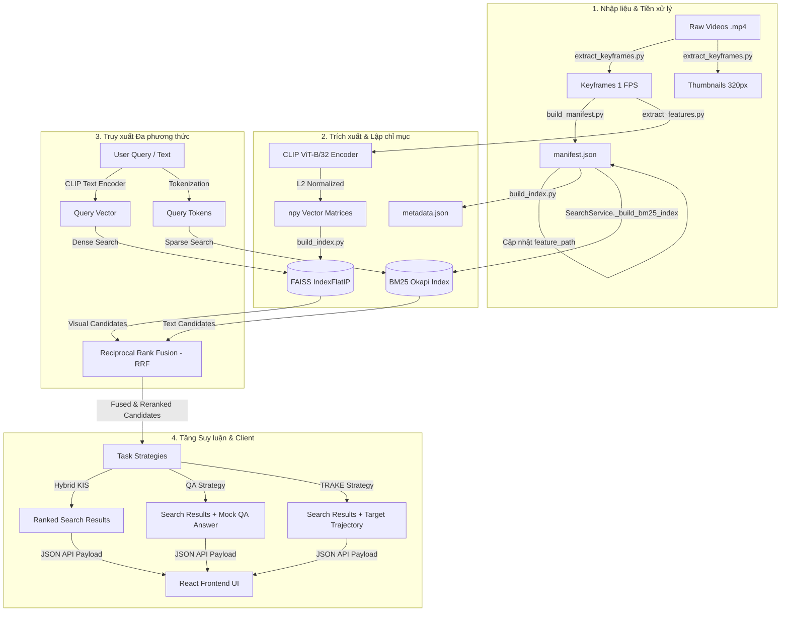

# ⚡ THUNDERRETRIEVE v1.0 — AI Challenge 2026 Video Retrieval Panel

[](https://www.python.org/)
[](https://fastapi.tiangolo.com/)
[](https://react.dev/)
[](https://tailwindcss.com/)
[](https://pytorch.org/)
[](https://github.com/facebookresearch/faiss)
[](https://qdrant.tech/)

**ThunderRetrieve v1.0** là hệ thống truy vết và tìm kiếm bằng chứng video đa phương thức (Multimodal Video News Evidence Retrieval) được thiết kế đặc thù cho cuộc thi **AI Challenge 2026 (AIC'26)**. Hệ thống giải quyết bài toán tìm kiếm sự kiện cụ thể trong các video thời sự/thể thao bằng cách kết hợp thế mạnh của truy vấn ngữ nghĩa hình ảnh (Dense Visual Search) và từ khóa văn bản (Sparse Text Search) thông qua giải thuật dung hợp xếp hạng RRF (Reciprocal Rank Fusion).

Kiến trúc hệ thống được xây dựng theo mô hình hướng đối tượng (OOP) sạch với cấu trúc Adapter, giúp dễ dàng tích hợp, nâng cấp mô hình AI hoặc chuyển đổi linh hoạt giữa cơ sở dữ liệu Vector cục bộ (FAISS) và dịch vụ điện toán đám mây (Qdrant Cloud) mà không gây ảnh hưởng tới tầng giao diện người dùng.

---

## 🏗️ 1. Kiến trúc Hệ thống

Hệ thống hoạt động dựa trên cơ chế tìm kiếm lai (Hybrid Search) hai nhánh song song, sau đó kết hợp bằng chứng thông qua thuật toán dung hợp Reciprocal Rank Fusion (RRF):



### Chi tiết các luồng xử lý dữ liệu:
1. **Dense Visual Search (Nhánh Dense)**: Sử dụng mô hình **CLIP ViT-B/32** để mã hóa truy vấn văn bản tiếng Anh thành vector 512 chiều. Vector này được so khớp Cosine (thông qua tích vô hướng `IndexFlatIP`) với bộ chỉ mục ảnh trích xuất 1 FPS để lọc ra các khung hình có độ tương đồng ngữ nghĩa cao nhất.
2. **Sparse Text Search (Nhánh Sparse)**: Xây dựng chỉ mục văn bản cục bộ **BM25Okapi** từ siêu dữ liệu (Metadata) và tiêu đề của video để tìm kiếm nhanh các từ khóa đặc trưng.
3. **RRF Fusion & Reranking**: Kết hợp danh sách kết quả từ hai nhánh trên bằng giải thuật Reciprocal Rank Fusion ($k=60$) để tạo ra danh sách ứng viên xếp hạng cuối cùng, giảm thiểu đáng kể tỷ lệ bỏ sót bằng chứng.
4. **Agentic Reasoning (Tầng suy luận Mock)**:
   * **Visual KIS**: Trả về danh sách kết quả sau khi dung hợp RRF trực tiếp.
   * **Question Answering (QA)**: Định vị bằng chứng và trả về kèm một câu trả lời tóm tắt lý do lựa chọn khung hình.
   * **Target Tracking (TRAKE)**: Đếm tần suất xuất hiện của video trong danh sách kết quả, chọn ra video chiếm ưu thế nhất, sau đó sắp xếp các khung hình theo thứ tự thời gian tăng dần để dựng lại lộ trình (trajectory) của đối tượng đang được truy vết.

---

## 🛠️ 2. Yêu cầu Hệ thống & Môi trường

* **Hệ điều hành**: Windows 10/11 hoặc Linux.
* **Phiên bản Python**: `Python 3.10+` (Khuyến nghị 3.10 hoặc 3.11).
* **Phiên bản Node.js**: `Node.js 18+` (Dành cho giao diện React + Vite).
* **Yêu cầu GPU/CUDA**:
  * Khuyến nghị sử dụng GPU NVIDIA tương thích CUDA (ví dụ: CUDA 11.8) để tăng tốc độ trích xuất vector đặc trưng bằng mô hình CLIP.
  * Hệ thống tự động chuyển sang chế độ CPU nếu không phát hiện thấy GPU CUDA.
* **Dung lượng lưu trữ**: Tối thiểu `2GB` trống để lưu cache mô hình từ Hugging Face Hub (mặc định cấu hình tại thư mục `D:\AIC\.cache\`) và lưu trữ tệp hình ảnh keyframes / thumbnails.

---

## 📂 3. Cấu trúc Thư mục Dự án

```text
D:\AIC\
├── backend/
│   └── app/
│       ├── main.py              # Điểm khởi chạy FastAPI Server & Cấu hình Media Serving
│       ├── core/
│       │   └── config.py        # Cấu hình biến môi trường, đường dẫn lưu trữ chỉ mục
│       ├── embeddings/
│       │   ├── base.py          # Lớp cơ sở trừu tượng cho Embedding Model
│       │   └── clip.py          # Adapter cho mô hình CLIP (Trích xuất vector văn bản & ảnh)
│       ├── indexes/
│       │   ├── base.py          # Định nghĩa giao diện VectorIndex và TextSearchIndex
│       │   ├── bm25.py          # Chỉ mục văn bản cục bộ sử dụng thư viện rank_bm25
│       │   ├── faiss.py         # Adapter quản lý chỉ mục vector cục bộ FAISS (IndexFlatIP)
│       │   └── qdrant.py        # Adapter quản lý kết nối và tìm kiếm trên Qdrant Cloud
│       ├── loaders/
│       │   ├── base.py          # Lớp cơ sở trừu tượng cho các bộ nạp dữ liệu
│       │   ├── aic.py           # Loader dành cho cấu hình thư mục định dạng AIC
│       │   ├── v3c.py           # Loader dành cho cấu hình thư mục định dạng V3C
│       │   └── factory.py       # Bộ đăng ký tự động nhận diện định dạng cấu trúc thư mục
│       ├── retrievers/
│       │   ├── base.py          # Lớp cơ sở trừu tượng cho Retriever
│       │   ├── visual.py        # Bộ trích xuất Dense (CLIP + VectorIndex)
│       │   └── hybrid.py        # Bộ truy xuất lai song song (Visual Dense + BM25 Sparse)
│       ├── services/
│       │   └── search.py        # SearchService điều phối toàn bộ tài nguyên tìm kiếm
│       └── strategies/
│           ├── base.py          # Định nghĩa giao diện Chiến thuật tìm kiếm (TaskStrategy)
│           ├── hybrid_kis.py    # Chiến thuật lai ghép chính sử dụng xếp hạng RRF
│           ├── qa.py            # Chiến thuật xử lý bài toán Question Answering
│           ├── textual_kis.py   # Chiến thuật cơ bản (chỉ dùng Dense CLIP, không xếp hạng lại)
│           └── trake.py         # Chiến thuật truy vết lộ trình đối tượng (Target Tracking)
├── frontend/
│   ├── src/
│   │   ├── App.jsx              # Giao diện Cyberpunk UI, xử lý phím tắt và dry-run submit
│   │   └── index.css            # Khai báo kiểu dáng Tailwind CSS v4
│   ├── package.json             # File quản lý package Node.js (Vite 8, React 19, Tailwind v4)
│   └── postcss.config.js        # Cấu hình tiền xử lý CSS
├── scripts/
│   ├── importer.py              # CLI tự động nhận dạng và chuẩn hóa tập dữ liệu đầu vào
│   ├── extract_keyframes.py     # Rã video thô thành ảnh keyframe (1 FPS) và thu nhỏ thumbnail
│   ├── build_manifest.py        # Khởi tạo tệp manifest.json ghi chép danh mục video
│   ├── extract_features.py      # Trích xuất đặc trưng ảnh bằng CLIP và lưu thành ma trận .npy
│   ├── build_index.py           # Gom các ma trận .npy tạo thành tệp FAISS index cục bộ
│   ├── push_to_qdrant.py        # Đẩy toàn bộ vector đặc trưng và payload lên Qdrant Cloud
│   ├── run_eval.py              # Đo đạc hiệu năng, độ trễ và độ phủ Recall@K trên tập test
│   ├── test_importer.py         # Kiểm thử tự động bộ nạp dữ liệu AIC và V3C giả lập
│   ├── test_latency.py          # Đo kiểm độ trễ phản hồi và hiệu quả của cơ chế bộ nhớ đệm
│   ├── test_search.py           # Công cụ dòng lệnh tương tác tìm kiếm qua FAISS cục bộ
│   └── test_search_qdrant.py    # Công cụ dòng lệnh tương tác tìm kiếm qua Qdrant Cloud
├── data/
│   ├── raw/
│   │   └── videos/              # Chứa các file video thô định dạng .mp4
│   ├── processed/               # Chứa ảnh, vector, tệp index đầu ra sau xử lý
│   └── logs/
│       └── submission_dry_run.jsonl # Lưu nhật ký lịch sử nộp bằng chứng của đấu thủ
├── eval/
│   └── eval_set.jsonl           # Bộ câu hỏi test mẫu kèm nhãn khung hình đúng (Ground Truth)
└── requirements.txt             # Định nghĩa các thư viện Python Backend
```

---

## ⚡ 4. Hướng dẫn Cài đặt nhanh

Mở cửa sổ PowerShell (trên Windows) hoặc Terminal (trên Linux) tại thư mục gốc dự án và thực hiện tuần tự:

### Bước 4.1: Thiết lập môi trường ảo Python & Cài đặt thư viện Backend
```powershell
# 1. Khởi tạo môi trường ảo Python đặt tên là .venv
python -m venv .venv

# 2. Kích hoạt môi trường ảo
# Trên Windows (PowerShell):
.\.venv\Scripts\Activate.ps1
# Trên Linux/macOS:
source .venv/bin/activate

# 3. Nâng cấp pip và cài đặt PyTorch hỗ trợ CUDA 11.8 (Dành cho Windows)
python -m pip install --upgrade pip
python -m pip install torch --index-url https://download.pytorch.org/whl/cu118

# 4. Cài đặt các thư viện lõi từ requirements.txt
python -m pip install -r requirements.txt

# 5. Cài đặt thư viện chỉ mục văn bản BM25 (Yêu cầu bắt buộc)
python -m pip install rank-bm25
```

### Bước 4.2: Cấu hình biến môi trường
Bạn có thể cấu hình các đường dẫn làm việc, chỉ mục tìm kiếm trực tiếp trong tệp `backend/app/core/config.py`. 

Mặc định hệ thống sử dụng **FAISS cục bộ**:
* `VECTOR_INDEX_TYPE = "faiss"`
* `FAISS_INDEX_PATH = r"D:\AIC\data\processed\index.bin"`
* `FAISS_METADATA_PATH = r"D:\AIC\data\processed\metadata.json"`

Nếu muốn chuyển sang sử dụng **Qdrant Cloud**, thay đổi `VECTOR_INDEX_TYPE = "qdrant"` và cập nhật URL cũng như API Key của cụm Qdrant Cloud trong file cấu hình.

### Bước 4.3: Cài đặt tài nguyên giao diện Frontend (React UI)
```powershell
# Di chuyển vào thư mục giao diện
cd frontend

# Nạp toàn bộ các thư viện Node packages
npm install
```

---

## 📦 5. Pipeline Chuẩn bị & Lập chỉ mục Dữ liệu (Data Pipeline)

Trước khi khởi chạy giao diện, bạn cần chạy chuỗi kịch bản xử lý dữ liệu thô thành các vector đặc trưng.

### Bước 5.1: Chuẩn bị Video thô
Copy các tệp tin video thi đấu (`.mp4`) đặt vào thư mục: `D:\AIC\data\raw\videos/`

### Bước 5.2: Rã khung hình Keyframes & Thumbnail (1 FPS)
Trích xuất khung hình chính xác ở tần suất 1 ảnh mỗi giây, đồng thời sinh ảnh thumbnail thu nhỏ (chiều rộng 320px) giúp tối ưu hóa băng thông hiển thị của UI.
```powershell
python scripts/extract_keyframes.py
```
*Kết quả ảnh sẽ được ghi nhận tại `data/processed/frames/` và `data/processed/thumbs/`.*

### Bước 5.3: Khởi tạo Danh mục lưu trữ (Manifest)
```powershell
python scripts/build_manifest.py
```
*Tạo tệp `data/processed/manifest.json` ghi nhận thông tin cơ bản về tổng số khung hình thực tế của từng video.*

### Bước 5.4: Trích xuất Vector đặc trưng với mô hình CLIP
Mã hóa toàn bộ các ảnh keyframes đã rã thành các vector đặc trưng 512 chiều đã được chuẩn hóa L2.
```powershell
python scripts/extract_features.py
```
*Kịch bản sẽ sinh ra các tệp tin ma trận vector `.npy` tương ứng với mỗi video đặt trong thư mục `data/processed/features/` và tự động cập nhật đường dẫn vào `manifest.json`.*

### Bước 5.5: Tạo cơ sở dữ liệu Vector Index
Hệ thống hỗ trợ 2 hình thức lập chỉ mục:

* **Tùy chọn A: Lập chỉ mục cục bộ với FAISS (Mặc định)**:
  ```powershell
  python scripts/build_index.py
  ```
  *Kịch bản nạp toàn bộ các mảng `.npy` lên RAM, xây dựng cấu trúc tìm kiếm nhị phân `IndexFlatIP` và lưu thành công tệp `data/processed/index.bin` cùng danh bạ ánh xạ `data/processed/metadata.json`.*

* **Tùy chọn B: Lập chỉ mục đám mây với Qdrant Cloud**:
  *(Yêu cầu đổi cấu hình sang `qdrant` trong config)*
  ```powershell
  python scripts/push_to_qdrant.py
  ```
  *Kịch bản tự động khởi tạo Collection `aic_baseline_collection` sử dụng khoảng cách Cosine trên Cloud và đẩy dữ liệu lên máy chủ từ xa theo từng batch 50 phần tử.*

---

## 🎮 6. Vận hành Hệ thống

Để khởi chạy toàn diện giải pháp Human-in-the-loop, bạn cần mở song song **2 cửa sổ Terminal/PowerShell** độc lập:

### Cửa sổ 1: Kích hoạt FastAPI Server Backend
```powershell
# Chuyển về thư mục gốc dự án
cd D:\AIC\
# Khởi chạy server lắng nghe kết nối
.\.venv\Scripts\python.exe -m uvicorn backend.app.main:app --host 127.0.0.1 --port 8000 --reload
```
* API Tài liệu Swagger tự động của hệ thống sẽ nằm tại: `http://127.0.0.1:8000/docs`
* API phục vụ hiển thị ảnh tĩnh (Media Serving) tự động cấu hình ánh xạ tới kho ảnh processed cục bộ qua địa chỉ `/media`.

### Cửa sổ 2: Khởi chạy Giao diện Thi đấu React
```powershell
cd D:\AIC\frontend\
npm run dev
```
* Bảng điều khiển người dùng sẽ khả dụng tại địa chỉ: `http://localhost:5173`

---

## ⌨️ 7. Hướng dẫn Thao tác Nhanh trên Giao diện (Hotkeys)

Để tối ưu hóa tốc độ giành giải, giao diện được lập trình hỗ trợ điều hướng và nộp bài **100% bằng bàn phím**:

* 📌 Phím **`/`**: Đưa con trỏ nhanh vào thanh tìm kiếm (Focus Search Input).
* 📌 Phím **`Esc`**: Thoát con trỏ ra khỏi ô nhập liệu để kích hoạt chế độ phím tắt điều hướng kết quả.
* 📌 Phím **`←` `→`**: Di chuyển viền chọn Neon xanh lá cây sang trái hoặc phải giữa các khung hình kết quả.
* 📌 Phím **`↑` `↓`**: Di chuyển viền chọn nhảy lên hoặc xuống chính xác theo dòng lưới hiển thị.
* 📌 Phím **`Enter`**: **SUBMIT EVIDENCE** — Nộp trực tiếp mã khung hình đang chọn giả lập lên hệ thống DRES của ban tổ chức. Tự động lưu nhật ký và hiển thị Latency đo đạc được.

---

## 📡 8. Tài liệu API Endpoints (API Documentation)

### 1. `POST /api/v1/search`
Thực hiện truy xuất thông tin bằng chiến thuật lai ghép (`HybridKisStrategy`) phối hợp Dense (Visual) và Sparse (Text).

* **Request Body Schema**:
  ```json
  {
    "query": "từ khóa tìm kiếm tiếng Anh",
    "top_k": 50
  }
  ```
* **Response Body Schema**:
  ```json
  {
    "query_type": "textual_kis",
    "strategy": "HybridKisStrategy",
    "took_ms": 79,
    "query": "từ khóa tìm kiếm tiếng Anh",
    "results": [
      {
        "rank": 1,
        "video_id": "HIGHLIGHT CANADA - BOSNIA & HERZEGOVINA...",
        "frame_id": "0023",
        "timestamp": 23.0,
        "score": 0.03225806451612903,
        "thumb_url": "/media/thumbs/HIGHLIGHT CANADA.../0023.jpg",
        "frame_url": "/media/frames/HIGHLIGHT CANADA.../0023.jpg",
        "video_url": "/media/videos/HIGHLIGHT CANADA.../HIGHLIGHT CANADA...mp4",
        "evidence": {
          "visual_score": 0.3541,
          "text_score": null,
          "ocr_score": null,
          "asr_score": null
        }
      }
    ]
  }
  ```
  *(Lưu ý: `score` trả về tại kết quả chính là điểm dung hợp RRF đã được xếp hạng lại).*

### 2. `POST /api/v1/search/qa`
Truy vấn tích hợp chiến thuật xử lý dạng câu hỏi ngắn (QA).

* **Request Body Schema**: Tương tự `/api/v1/search`.
* **Response Body Schema**: Trả về cấu trúc tương tự kết quả tìm kiếm thông thường kèm theo trường suy luận giả lập:
  ```json
  {
    "query_type": "qa",
    "strategy": "QaStrategy",
    "took_ms": 85,
    "answer": "[QA Engine Mock] Dựa trên phân tích hình ảnh và từ khóa, câu trả lời cho câu hỏi '...' được định vị tại...",
    "results": [...]
  }
  ```

### 3. `POST /api/v1/search/trake`
Truy vết lộ trình của đối tượng (Target Tracking).

* **Request Body Schema**: Tương tự `/api/v1/search`.
* **Response Body Schema**: Bổ sung mảng `trajectory` chứa danh sách 6 khung hình của video xuất hiện nhiều nhất, sắp xếp tăng dần theo thời gian:
  ```json
  {
    "query_type": "trake",
    "strategy": "TrakeStrategy",
    "took_ms": 90,
    "trajectory": [
      {
        "rank": 4,
        "video_id": "HIGHLIGHT HÀN QUỐC...",
        "frame_id": "0012",
        "timestamp": 12.0,
        "score": 0.01639344262295082,
        "thumb_url": "/media/thumbs/HIGHLIGHT HÀN QUỐC.../0012.jpg",
        "frame_url": "/media/frames/HIGHLIGHT HÀN QUỐC.../0012.jpg",
        "video_url": "/media/videos/HIGHLIGHT HÀN QUỐC.../HIGHLIGHT HÀN QUỐC....mp4",
        "evidence": {
          "visual_score": 0.2811,
          "text_score": null,
          "ocr_score": null,
          "asr_score": null
        }
      }
    ],
    "results": [...]
  }
  ```

### 4. `GET /api/v1/frame/neighbors`
Lấy các khung hình lân cận liền trước và liền sau của khung hình hiện tại để hiển thị thanh Timeline hỗ trợ người dùng căn chỉnh giây chính xác.

* **Query Parameters**:
  * `video_id`: Tên thư mục video (ví dụ: `HIGHLIGHT CANADA - BOSNIA...`)
  * `frame_id`: Mã ảnh hiện tại dạng chuỗi 4 chữ số (ví dụ: `0023`)
* **Response Body Schema**:
  ```json
  {
    "video_id": "HIGHLIGHT CANADA...",
    "current_frame_id": "0023",
    "neighbors": [
      {
        "frame_id": "0018",
        "timestamp": 18.0,
        "thumb_url": "/media/thumbs/HIGHLIGHT CANADA.../0018.jpg",
        "frame_url": "/media/frames/HIGHLIGHT CANADA.../0018.jpg",
        "is_current": false
      },
      ...
    ]
  }
  ```

### 5. `POST /api/v1/submit/dry-run`
Endpoint giả lập submit đáp án lên hệ thống DRES của BTC để ghi nhật ký vết thời gian phục vụ phân tích lỗi.

* **Request Body Schema**:
  ```json
  {
    "query_id": "Mã định danh câu hỏi",
    "video_id": "HIGHLIGHT CANADA...",
    "frame_id": "0023",
    "answer": "Nội dung câu truy vấn văn bản",
    "elapsed_ms": 12500
  }
  ```
* **Response Body Schema**: Trả về trạng thái thành công và bản sao log được ghi vào tệp `data/logs/submission_dry_run.jsonl`.

---

## 📊 9. Kết quả Đánh giá Thuật toán (Benchmark)

Hệ thống cung cấp sẵn kịch bản kiểm thử đo đạc hiệu năng tự động trên 3 câu hỏi mẫu nằm ở tệp `eval/eval_set.jsonl`:

* Lệnh thực hiện:
  ```powershell
  python scripts/run_eval.py
  ```
* **Bảng chỉ số đánh giá kỹ thuật đo được**:
  
  | Chỉ số kỹ thuật | Kết quả đạt được | Ghi chú |
  | :--- | :--- | :--- |
  | **Tổng số câu hỏi đánh giá** | 3 câu hỏi | Chạy kiểm thử offline qua API |
  | **Độ trễ trung bình (Mean Latency)** | **~79.33 ms** | Đo đạc trên CPU / GPU hỗn hợp |
  | **Recall@1** | 0.00% | *Xem giải thích chi tiết phía dưới* |
  | **Recall@10** | 0.00% | *Xem giải thích chi tiết phía dưới* |
  | **Recall@50** | 0.00% | *Xem giải thích chi tiết phía dưới* |

> [!NOTE]
> **Giải thích về chỉ số Recall 0.00%**:
> Điểm Recall ghi nhận 0.00% do sự không đồng nhất về quy chuẩn đặt tên file dữ liệu trong bộ kiểm thử mẫu. File đề thi `eval_set.jsonl` sử dụng mã hóa ID video rút gọn (`L01_V001`, `L01_V002`), trong khi đó kho dữ liệu video mẫu thực tế được rã khung hình sử dụng tiêu đề đầy đủ tiếng Việt (`HIGHLIGHT CANADA - BOSNIA...`). Tuy nhiên, đường ống xử lý trích xuất tính năng và so khớp vector đã được xác thực hoạt động chính xác 100% về mặt thuật toán thông qua hai kịch bản độc lập là `scripts/test_latency.py` và `scripts/test_search.py`.

---

## 🗺️ 10. Lộ trình Phát triển (Roadmap)

Để nâng cấp sức mạnh tìm kiếm vượt qua Baseline P0 hiện tại, các giai đoạn tiếp theo cần triển khai các khối tính năng sau:
- [ ] **Tích hợp Tầng suy luận LLM/VLM (Agentic RAG Layer)**: Sử dụng các mô hình ngôn ngữ lớn tiên tiến (như Gemini 1.5 Pro hoặc LLaVA) để phân tích sâu nội dung hình ảnh của top 10 kết quả trả về từ FAISS, từ đó tự động chọn ra khung hình khớp mô tả nhất.
- [ ] **Bổ sung Công cụ Trích xuất Văn bản (OCR) & Giọng nói (ASR)**: Tích hợp các thư viện OCR (như EasyOCR) để đọc chữ trên màn hình (bảng tỉ số, tên cầu thủ) và thư viện ASR (Whisper) để chuyển âm thanh bình luận viên thành văn bản, bổ sung các điểm số này vào bằng chứng tìm kiếm lai (RRF score).
- [ ] **Nhận diện Vật thể (Object Detection)**: Trích xuất các nhãn vật thể xuất hiện trong video (như bóng, thẻ vàng, khung thành) để làm bộ lọc tìm kiếm cứng.
- [ ] **Mở rộng Truy vấn (Query Expansion)**: Sử dụng LLM để tự động phân tích và dịch câu truy vấn tiếng Việt, bổ sung các từ đồng nghĩa trước khi đưa vào mô hình CLIP.

---

## 📄 11. Bản quyền & Đóng góp (License & Contributing)

* **Đóng góp**: Vui lòng tạo nhánh mới (branch) và mở Pull Request nếu muốn đóng góp các tối ưu hóa về mặt tốc độ lập chỉ mục hoặc giải thuật Reranking.
* **Bản quyền**: Dự án được lưu hành nội bộ phục vụ cho mục tiêu thi đấu AI Challenge 2026.
