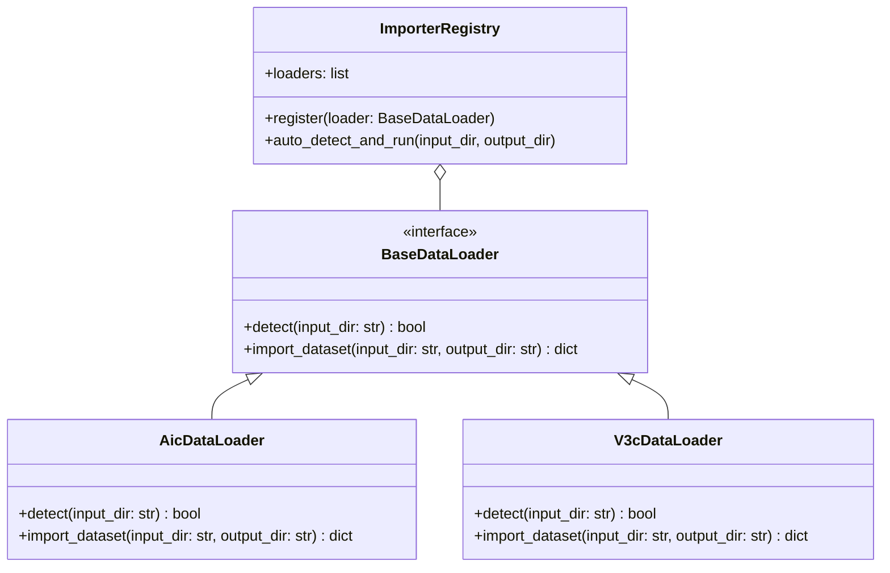

# Kế Hoạch Hướng 4: Thiết Kế Bộ Importer Mềm Dẻo Cho Dataset Mới

## 1. Rationale (Lý do thực hiện)
Trong các cuộc thi AI Challenge (như AIC), cấu trúc dữ liệu do Ban tổ chức (BTC) công bố có thể thay đổi bất ngờ vào ngày mở cổng thi đấu (ví dụ: chia nhỏ thành nhiều phần, lồng ghép thư mục video và keyframe khác nhau, hoặc sử dụng định dạng chuẩn V3C của TRECVID). 

Nếu hệ thống Backend bị ràng buộc cứng với một cấu trúc thư mục cố định, chúng ta sẽ mất rất nhiều thời gian quý báu trong phòng thi chỉ để viết lại các script đọc file, nạp dữ liệu và xây dựng lại vector index. 

Do đó, **Hướng 4** hướng tới việc xây dựng một bộ nạp dữ liệu (Importer Engine) hướng đối tượng cực kỳ linh hoạt (Flexible Adapter Pattern), tự động nhận diện cấu trúc đầu vào và ánh xạ (mapping/symlink) về định dạng chuẩn hóa của hệ thống để chạy ngay lập tức.

---

## 2. Thiết Kế Kiến Trúc Lớp (Class Architecture)



### Các lớp thành phần:
1.  **`BaseDataLoader` (Interface):**
    *   `detect(input_dir)`: Kiểm tra cấu trúc thư mục đặc trưng của tập dữ liệu đó để tự động kích hoạt Loader phù hợp.
    *   `import_dataset(input_dir, output_dir)`: Thực hiện quét, sao chép/tạo liên kết tượng trưng (symlinks) và kết xuất metadata/manifest chuẩn.
2.  **`AicDataLoader` (Adapter):**
    *   Đọc cấu trúc dữ liệu chuẩn AIC thường gặp (thư mục phẳng chứa các thư mục video con trực tiếp, mỗi thư mục video chứa các file ảnh JPG dạng `0000.jpg`, `0001.jpg`...).
3.  **`V3cDataLoader` (Adapter):**
    *   Đọc cấu trúc dữ liệu của bộ dữ liệu TRECVID V3C (keyframes nằm sâu trong các thư mục con phân cấp như `V3C1/v3c1_00001/keyframes/` kèm các file đặc trưng khác).
4.  **`ImporterRegistry` (Factory/Registry):**
    *   Đăng ký tất cả các loader có sẵn. Quét thư mục đầu vào và giao cho loader phù hợp thực hiện công việc.

---

## 3. Các Bước Thực Hiện & File Thay Đổi

### 3.1. Tạo mới Base & Concrete Loaders
*   **[base.py](file:///d:/AIC/backend/app/loaders/base.py) [NEW]:** Định nghĩa interface `BaseDataLoader`.
*   **[aic.py](file:///d:/AIC/backend/app/loaders/aic.py) [NEW]:** Triển khai loader dành cho cấu trúc AIC.
*   **[v3c.py](file:///d:/AIC/backend/app/loaders/v3c.py) [NEW]:** Triển khai loader dành cho cấu trúc V3C.
*   **[factory.py](file:///d:/AIC/backend/app/loaders/factory.py) [NEW]:** Registry quản lý và phân phối loader tự động.

### 3.2. Viết CLI Script Tự Động Hóa
*   **[importer.py](file:///d:/AIC/scripts/importer.py) [NEW]:** Viết script CLI nhận tham số đầu vào:
    ```bash
    python scripts/importer.py --input_dir /path/to/raw/dataset --output_dir data/processed
    ```
    Script này sẽ:
    1.  Tự động gọi `ImporterRegistry` để phát hiện kiểu dataset.
    2.  Tạo các liên kết tượng trưng (symlinks) từ thư mục gốc sang `data/processed/frames` và `data/processed/thumbs` để tiết kiệm dung lượng ổ đĩa (tránh nhân đôi dữ liệu).
    3.  Tạo ra file `manifest.json` chuẩn hóa cho hệ thống.

---

## 4. Kế Hoạch Xác Thực (Verification Plan)
1.  **Tạo thư mục giả lập (Mock):**
    *   Tạo cấu trúc thư mục mock của bộ dữ liệu AIC.
    *   Tạo cấu trúc thư mục mock của bộ dữ liệu V3C.
2.  **Chạy kiểm thử:**
    *   Chạy `python scripts/importer.py --input_dir <mock_aic_dir> --output_dir <output_dir>`.
    *   Xác nhận file `manifest.json` được sinh ra đúng cấu trúc, các file ảnh được mapping chính xác.
    *   Chạy tương tự với thư mục V3C để kiểm tra tính mềm dẻo.
